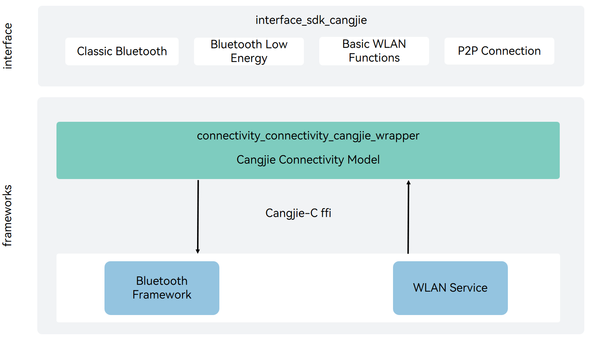

# connectivity_cangjie_wrapper

## Introduction

The communication_cangjie_wrapper is a Cangjie API encapsulated on OpenHarmony based on the capabilities of the Distributed Connectivity Subsystem. The Connectivity subsystem provides the following communication capabilities for OpenHarmony:

- WLAN: basic WLAN functions, peer-to-peer (P2P) connection, and WLAN notification, enabling your application to communicate with other devices through a WLAN.

- Bluetooth: classic Bluetooth and Bluetooth Low Energy (BLE).

## Architecture

**Figure 1**




## Directory Structure

The DSoftBus directory structure is as follows:

```
foundation/communication/connectivity_cangjie_wrapper
├── ohos             # Cangjie DSoftBus code
├── kit              # Cangjie kit code
├── figures          # architecture pictures
```

## Constraints

The devices must be in the same LAN.

## Usage

### DSoftBus

-   Networking

1.  The server starts and obtains the list of online devices.
2.  Register a listener for device status changes.
3.  Obtain the device ID, name, and type.
4.  Obtain detailed information about the device, such as the device type, networking type, and device capability.
5.  Delete the registered listener when the process exits.

-   Transmission

1.  Creates a socket instance based on information, such as the socket name and caller bundle name.
2.  The server starts listening for the socket, and the client binds the socket.
3.  Send data after the bind is successful.
4.  Close the socket when it is not used.

## Repositories Involved

[communication\_bluetooth](https://gitee.com/openharmony/communication_bluetooth/blob/master/README.md)

[communication\_wifi](https://gitee.com/openharmony/communication_wifi/blob/master/README.md)
