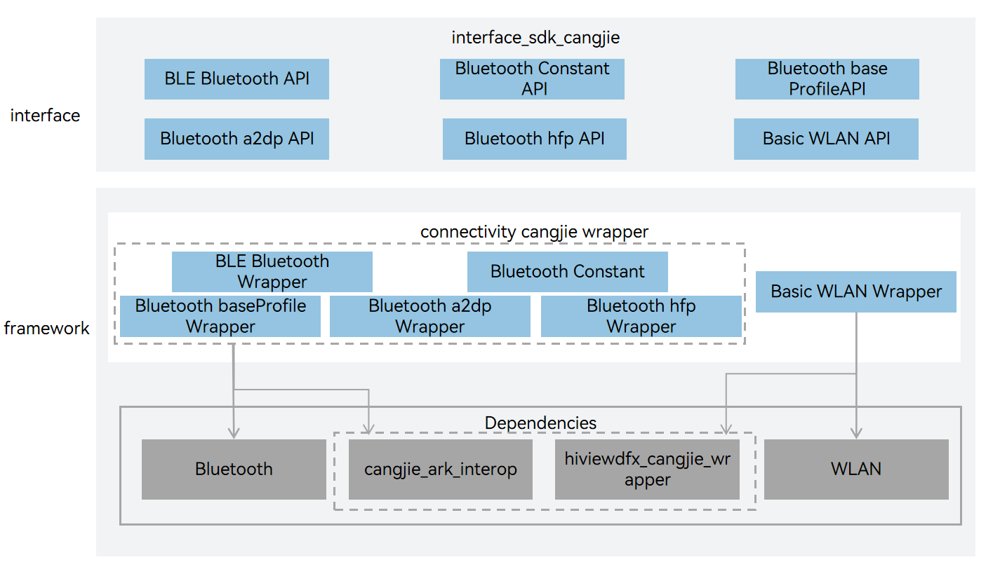

# connectivity_cangjie_wrapper

## Introduction

The connectivity_cangjie_wrapper is a Cangjie API encapsulated on OpenHarmony based on the capabilities of the Distributed Connectivity Subsystem. The Connectivity subsystem provides the following communication capabilities for OpenHarmony, The basic communication Cangjie interface is only available for standard devices.

- WLAN: basic WLAN functions, peer-to-peer (P2P) connection, and WLAN notification, enabling your application to communicate with other devices through a WLAN.

- Bluetooth: classic Bluetooth and Bluetooth Low Energy (BLE).

## System Architecture

**Figure 1**



As shown in the architecture diagram:

- Low-Energy Bluetooth (BLE) Wrapper: A type of Bluetooth technology that enables communication under low power consumption.
- Bluetooth Profile Wrapper: A Bluetooth-based universal file transfer protocol that enables file transfer between devices, such as A2DP, HFP, etc.
- Basic WLAN Functionality Wrapper: Provides P2P (Peer-to-Peer) functionality, a point-to-point connection technology that allows direct establishment of a TCP/IP link between two STAs (Station, a device that connects to a wireless network).
- Cangjie Basic Communication FFI Interface: Defines the interoperation interface between Cangjie and the C language, and is responsible for invoking the basic communication service capabilities through interoperation.

## Directory Structure

The connectivity cangjie wrapper directory structure is as follows:

```
foundation/communication/connectivity_cangjie_wrapper
├── figures                          # architecture pictures
├── kit                              # kit code
│   └── ConnectivityKit              # Cangjie ConnectivityKit code implementation
├── ohos                             # Cangjie connectivity code
│   ├── bluetooth                    # Cangjie bluetooth code implementation
│   │   ├── a2dp                     # a2dp Profile interfaces
│   │   ├── base_profile             # Bluetooth base profile interfaces
│   │   ├── ble                      # Bluetooth Low-Energy interfaces
│   │   ├── connection               # Bluetooth connection interfaces
│   │   ├── constant                 # Bluetooth constant definitions
│   │   ├── error_message.cj         # Bluetooth error message definitions
│   │   └── hfp                      # hfp Profile interfaces
│   └── wifi_manager                 # Cangjie wifi code implementation
└── test                             # Test code
    └── APILevel22                   # API Level 22 test code
        ├── bluetooth                # Bluetooth tests
        │   └── test                 # Bluetooth test project
        └── wifi_manager             # WiFi tests
            └── test                 # WiFi test project
```

As shown in the architecture:

- Bluetooth Low Energy: A wireless, low-power Bluetooth technology
- P2P Connection：A peer-to-peer connection technology that enables the direct establishment of a TCP/IP link between two STAs.
- Cangjie Connectivity FFI Interface：Define the FFI interface between Cangjie and C language, which is responsible for invoking the basic communication service capabilities through interoperation.

## Usage

### bluetooth api

Bluetooth-related api, which currently provide BLE-related capabilities, including BLE device gatt-related operations, as well as BLE broadcasting, scanning and other functions.

-   BLE（Bluetooth Low Energy）

Bluetooth Low Energy (BLE) is a wireless, low-power Bluetooth technology. Compared with Classic Bluetooth, BLE allows for lower power consumption and is applicable to devices with long standby time, such as smart watches, healthcare devices, smart home devices.

For details, please refer to [ble API](https://gitcode.com/openharmony-sig/arkcompiler_cangjie_ark_interop/blob/master/doc/API_Reference/source_en/apis/ConnectivityKit/cj-apis-bluetooth-ble.md)。

-   A2DP（Advanced Audio Distribution Profile）

Advanced Audio Distribution Profile (A2DP) allows high-quality multimedia audio (such as music and voice) to be streamed between devices over a Bluetooth connection. It supports bidirectional communication and can be used in devices such as headsets, speakers, and car audio devices.

For details, please refer to [a2dp API](https://gitcode.com/openharmony-sig/arkcompiler_cangjie_ark_interop/blob/master/doc/API_Reference/source_en/apis/ConnectivityKit/cj-apis-bluetooth-a2dp.md)。

Compared with the API capabilities provided by ArkTS, Bluetooth socket module-related functions are not yet provided.

For relevant guidance, please refer to [Overview of Bluetooth Service Development](https://gitcode.com/openharmony-sig/arkcompiler_cangjie_ark_interop/blob/master/doc/Dev_Guide/source_en/connectivity/bluetooth/cj-bluetooth-overview.md)

### Wifi api

WLAN-related api provide users with WLAN basic functions, peer-to-peer (P2P) functions, and corresponding services such as WLAN message notifications, so that applications can be interconnected with other devices through WLAN.

#### P2P mode

The P2P mode is also called Wi-Fi Direct, which allows two devices to establish a direct Wi-Fi connection without an intermediary wireless access point (AP). It can set up a TCP/IP connection between two STAs without an AP. Of the two STAs, one is called the group owner (GO), which serves as a traditional AP. the other is called a group client (GC), which connects to the GO like an AP.

For details, see [wifi API](https://gitcode.com/openharmony-sig/arkcompiler_cangjie_ark_interop/blob/master/doc/API_Reference/source_en/apis/ConnectivityKit/cj-apis-wifi_manager.md)。

Compared with the API capabilities provided by ArkTS, STA mode and AP mode are not available.

## Code Contribution

Developers are welcome to contribute code, documentation, etc. For specific contribution processes and methods, please refer to [Code Contribution](https://gitcode.com/openharmony/docs/blob/master/en/contribute/code-contribution.md).

## Repositories Involved

[communication_bluetooth](https://gitcode.com/openharmony/communication_bluetooth/blob/master/README.md)

[communication_wifi](https://gitcode.com/openharmony/communication_wifi/blob/master/README.md)

[arkcompiler_cangjie_ark_interop](https://gitcode.com/openharmony-sig/arkcompiler_cangjie_ark_interop/blob/master/README.md)

[hiviewdfx_hiviewdfx_cangjie_wrapper](https://gitcode.com/openharmony-sig/hiviewdfx_hiviewdfx_cangjie_wrapper/blob/master/README.md)