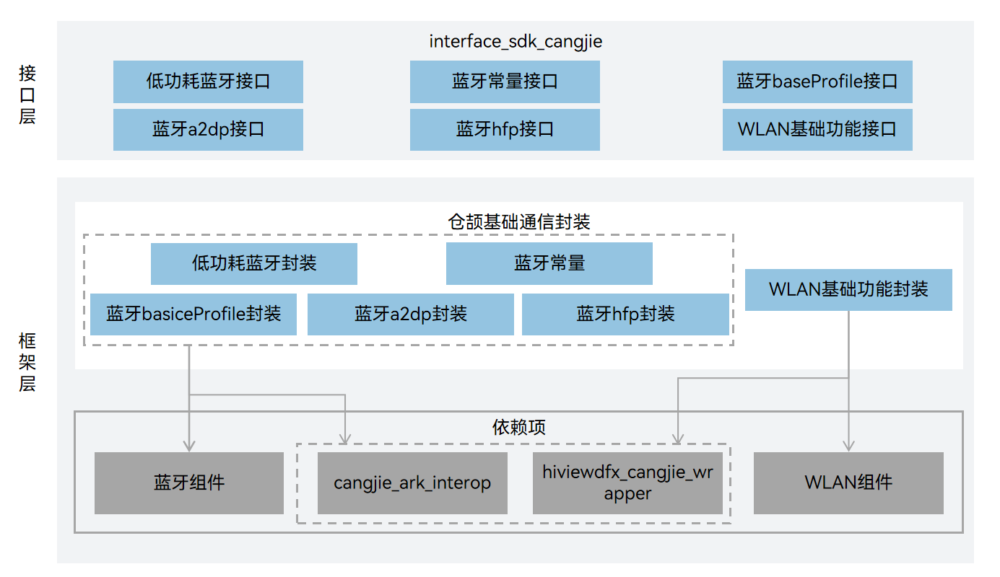

# 基础通信仓颉接口

## 简介

基础通信仓颉接口是在 OpenHarmony 上基于基础通信子系统能力之上封装的仓颉API。基础通信子系统旨在为OpenHarmony系统提供的通信相关的能力，包括：WLAN服务能力、蓝牙服务能力、软总线、进程间通信RPC（Remote Procedure Call）等通信能力。

WLAN服务：为用户提供WLAN基础功能、P2P（peer-to-peer）功能和WLAN消息通知的相应服务，让应用可以通过WLAN和其他设备互联互通。

蓝牙服务：为应用提供传统蓝牙以及低功耗蓝牙相关功能和服务。

## 系统架构

**图 1**  基础通信仓颉架构图




## 目录

基础通信仓颉主要代码目录结构如下：

```
foundation/communication/connectivity_cangjie_wrapper
├── ohos             # 仓颉分布式软总线接口实现
├── kit              # 仓颉kit化代码
├── figures          # 存放readme中的架构图
```

## 使用说明

### 软总线

-   组网

1.  服务启动之后，获取已经在线的设备列表。
2.  注册上下线监听，通过回调通知感知设备列表变化。
3.  获取设备的Id、设备名称、设备类型。
4.  获取指定设备的设备类型，组网类型，设备能力等更多信息。
5.  进程退出时，删除上下线监听。

-   传输

1.  根据Socket名称，调用者包名等信息，创建Socket。
2.  服务端启动监听，客户端进行绑定。
3.  绑定成功，可发送数据。
4.  待Socket不使用时，关闭Socket。

## 相关仓

**基础通信仓颉**

[communication\_bluetooth](https://gitee.com/openharmony/communication_bluetooth/blob/master/README.md)

[communication\_wifi](https://gitee.com/openharmony/communication_wifi/blob/master/README.md)
